 

ML/AI and autonomous systems engineer with a full-stack foundation (C#, Python, React, Azure). Building real systems: drone control, geospatial intelligence, computer vision. SAIT Software Development alumni, 2026. Focused on defense autonomy and applied ML. Currently learning C++ and systems programming.

---

---

